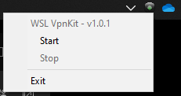

# wsl-vpnkit-tray

This repos constains Powershell Scripts to control (start/stop) [Wsl-Vpnkit](https://github.com/sakai135/wsl-vpnkit)
instance by a dedicated tray icon.



## Usage

Download the latest release, unzip to a specific directory and start the wsl-vpnkit-tray.cmd to be able
to control the [sakai135/wsl-vpnkit](https://github.com/sakai135/wsl-vpnkit) wsl2 instance with tray icon.

> The start process could take several seconds (less than 20s)...

To automaticly start the tray on windows session startup, you could use the `create-startup-shortcut.bat`.

If you change the wsl-vpnkit-tray directory location, you need to rerun the previous script.

## Status
| Icon | Description |
| --- | --- |
|  | The wsl-vpnkit instance is not detected (this is the startup status) |
|  | The instance is detected but not started |
|  | The instance is detected and started |


## Note on wsl-vpnkit wsl2 instance installation

> This script does not install wsl-vpnkit !!

Follow the Setup installation guide on sakai135 wsl-vpnkit home project:
```powershell
wsl --import wsl-vpnkit $env:USERPROFILE\wsl-vpnkit wsl-vpnkit.tar.gz --version 2
```

The most important part is the name of the wsl instance you will create when importing the tar.gz file.
This name is used by the wsl-vpnkit-tray to control the instance.

It has to be `wsl-vpnkit` (as set in the `$WslDistributionName` in `wsl-vpnkit-tray.ps1` file of this repo).
> Otherwise, edit the file and change the variable according to your wsl2 instance name.


# Thanks

To Sakay135 to build the wsl instance of his Cisco patch ...

